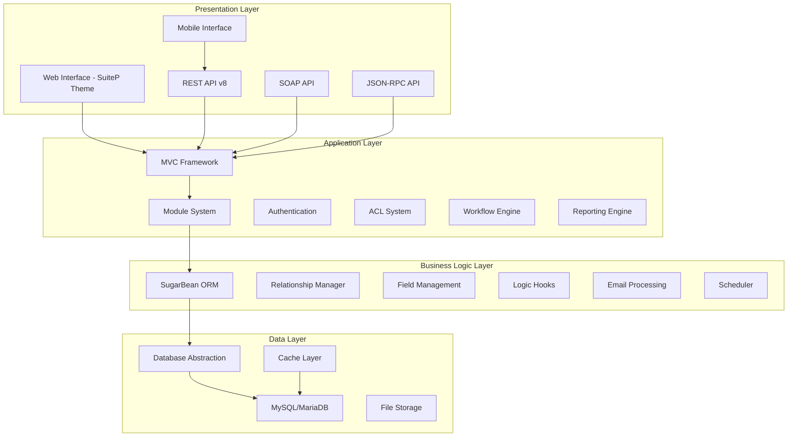

# SuiteCRM System Architecture Overview

## Executive Summary

SuiteCRM is a comprehensive, open-source Customer Relationship Management (CRM) system built on PHP. It follows a modular, object-oriented architecture with multiple APIs, a flexible theming system, and enterprise-grade features. The system is designed for scalability, customization, and integration with external systems.

## High-Level Architecture



## Core Architecture Components

### 1. Entry Point and Bootstrap System

**Location**: `index.php`, `include/entryPoint.php`

The system uses a single entry point architecture:

- **Main Entry**: `index.php` handles all web requests
- **Bootstrap Process**: `include/entryPoint.php` initializes the system
- **Application Execution**: `SugarApplication` class orchestrates request processing

**Key Features**:
- Security validation (`sugarEntry` constant)
- Configuration loading
- Database connection setup
- Session management
- Module and class autoloading

### 2. Model-View-Controller (MVC) Framework

**Location**: `include/MVC/`

SuiteCRM implements a custom MVC pattern:

#### Controllers (`include/MVC/Controller/`)
- **SugarController**: Base controller with action processing
- **ControllerFactory**: Creates appropriate controller instances
- **Action Mapping**: Flexible action-to-method routing
- **Entry Point Handling**: Support for custom entry points

#### Views (`include/MVC/View/`)
- **SugarView**: Base view class
- **ViewFactory**: Dynamic view instantiation
- **Template System**: Smarty-based templating
- **View Types**: Edit, Detail, List, Classic views

#### Models (Data Layer)
- **SugarBean**: Object-Relational Mapping (ORM)
- **BeanFactory**: Bean instantiation and caching
- **Relationship Management**: Complex entity relationships

### 3. Module System Architecture

**Location**: `modules/`

SuiteCRM uses a highly modular architecture:

#### Core Modules
- **User Management**: Users, Roles, ACL
- **CRM Entities**: Accounts, Contacts, Leads, Opportunities
- **Communication**: Emails, Calls, Meetings
- **Sales**: Quotes, Contracts, Products
- **Marketing**: Campaigns, Targets
- **Service**: Cases, Knowledge Base
- **Reporting**: Reports, Charts, Dashboards

#### Module Structure
```
modules/[ModuleName]/
├── [ModuleName].php           # Main bean class
├── controller.php             # Module controller
├── vardefs.php               # Field definitions
├── views/                    # Custom views
├── metadata/                 # UI metadata
├── language/                # Translations
└── Dashlets/                # Dashboard widgets
```

### 4. Data Layer Architecture

#### Object-Relational Mapping (ORM)
**Location**: `data/SugarBean.php`

- **SugarBean**: Base class for all data entities
- **Field Definitions**: Dynamic field management via vardefs
- **CRUD Operations**: Create, Read, Update, Delete functionality
- **Data Validation**: Built-in validation and sanitization
- **Audit Trail**: Automatic change tracking

#### Relationship Management
**Location**: `data/Relationships/`

- **Relationship Types**: One-to-One, One-to-Many, Many-to-Many
- **Link Fields**: Dynamic relationship navigation
- **Relationship Factory**: Automatic relationship instantiation
- **Query Building**: Optimized relationship queries

#### Database Abstraction
**Location**: `include/database/`

- **DBManager**: Database-agnostic interface
- **Connection Management**: Connection pooling and reuse
- **Query Building**: Safe SQL construction
- **Transaction Support**: ACID compliance

### 5. API Architecture

#### REST API v8
**Location**: `Api/V8/`

Modern RESTful API with:
- **JSON:API Specification**: Standard REST API format
- **OAuth2 Authentication**: Secure token-based auth
- **Resource Management**: CRUD operations on all entities
- **Relationship Handling**: Nested resource management
- **Middleware System**: Request/response processing pipeline

#### Legacy APIs
- **SOAP API**: Enterprise integration support
- **JSON-RPC**: Simple remote procedure calls
- **Custom Entry Points**: Specialized endpoints

### 6. Authentication and Security

#### Authentication System
**Location**: `modules/Users/authentication/`

- **Multiple Providers**: LDAP, SAML, Database
- **Session Management**: Secure session handling
- **Password Policies**: Configurable security rules
- **Two-Factor Authentication**: Optional 2FA support

#### Access Control Lists (ACL)
**Location**: `modules/ACL/`

- **Role-Based Access**: Hierarchical permission system
- **Field-Level Security**: Granular data access control
- **Team-Based Security**: Data segregation by teams
- **Security Groups**: Advanced permission grouping

### 7. User Interface and Theming

#### SuiteP Theme System
**Location**: `themes/SuiteP/`

- **Responsive Design**: Mobile-first responsive UI
- **Bootstrap Framework**: Modern CSS framework
- **SCSS Architecture**: Modular stylesheet organization
- **Sub-themes**: Multiple color schemes (Dawn, Day, Dusk, Night, Noon)
- **Customizable**: Theme configuration options

#### Template System
- **Smarty Engine**: Powerful templating
- **Template Inheritance**: Reusable template components
- **Custom Templates**: Override capability
- **Responsive Components**: Mobile-optimized widgets

### 8. Business Logic and Automation

#### Logic Hooks System
**Location**: `include/utils/LogicHook.php`

- **Event-Driven**: Trigger custom logic on system events
- **Before/After Hooks**: Pre and post-processing events
- **Module-Specific**: Targeted business logic
- **Custom Extensions**: Plugin architecture

#### Workflow Engine
**Location**: `modules/AOW_WorkFlow/`

- **Visual Workflow Designer**: Drag-and-drop workflow creation
- **Conditional Logic**: Complex business rules
- **Automated Actions**: Email, field updates, record creation
- **Scheduled Processing**: Time-based workflow execution

#### Scheduler System
**Location**: `modules/Schedulers/`

- **Cron Integration**: Scheduled job execution
- **Background Processing**: Long-running tasks
- **Job Management**: Start, stop, monitor jobs
- **Custom Jobs**: Extensible job system

### 9. Caching Architecture

**Location**: `include/SugarCache/`

Multi-tier caching system:

#### Cache Backends
- **Memory**: Request-level caching
- **File System**: Persistent file-based cache
- **Redis**: High-performance distributed cache
- **Memcached**: Distributed memory caching
- **APC/OPcache**: Opcode caching

#### Cache Strategy
- **Local Store**: Request-level cache
- **External Cache**: Persistent caching
- **Cache Invalidation**: Smart cache clearing
- **Performance Monitoring**: Cache hit/miss tracking

### 10. Email System

#### Email Processing
**Location**: `modules/Emails/`, `modules/InboundEmail/`

- **IMAP/POP3 Support**: Email account integration
- **Email Templates**: Dynamic email generation
- **Mass Email**: Campaign email distribution
- **Email Archiving**: Automatic email storage
- **Bounce Handling**: Email delivery monitoring

#### Email Workflows
- **Inbound Processing**: Automatic case/lead creation
- **Email Routing**: Intelligent email distribution
- **Auto-Response**: Automated email replies
- **Email Tracking**: Open and click tracking

### 11. Reporting and Analytics

#### Advanced Open Reports (AOR)
**Location**: `modules/AOR_Reports/`

- **Report Builder**: Drag-and-drop report creation
- **Multiple Data Sources**: Cross-module reporting
- **Chart Generation**: Visual data representation
- **Scheduled Reports**: Automated report delivery
- **Export Options**: Multiple output formats

#### Dashboard System
- **Customizable Dashboards**: Personalized views
- **Dashlets**: Reusable dashboard components
- **Real-time Updates**: Live data refresh
- **Role-Based Dashboards**: Targeted information display

### 12. Integration and Extension Points

#### Module Builder
**Location**: `modules/ModuleBuilder/`

- **Custom Modules**: Visual module creation
- **Field Designer**: Custom field definitions
- **Relationship Designer**: Visual relationship creation
- **Package Management**: Module deployment

#### Studio
**Location**: `modules/Studio/`

- **Layout Designer**: Visual form layout
- **Field Management**: Add/modify fields
- **Workflow Designer**: Business process automation
- **Label Editor**: Internationalization support

#### Custom Development
- **Custom Modules**: Extend functionality
- **Custom Fields**: Additional data attributes
- **Custom Logic Hooks**: Business rule implementation
- **Custom APIs**: Integration endpoints

## Performance and Scalability

### Database Optimization
- **Query Optimization**: Efficient SQL generation
- **Index Management**: Automatic index creation
- **Connection Pooling**: Database connection reuse
- **Read Replicas**: Load distribution support

### Caching Strategy
- **Multi-Level Caching**: Memory, file, and distributed caching
- **Smart Invalidation**: Targeted cache clearing
- **Session Optimization**: Efficient session storage
- **Static Asset Caching**: Browser-level caching

### Load Balancing
- **Stateless Design**: Session-independent processing
- **File Storage**: Shared file system support
- **Database Clustering**: Multi-server database support
- **CDN Integration**: Content delivery optimization

## Security Architecture

### Data Protection
- **Input Validation**: SQL injection prevention
- **XSS Protection**: Cross-site scripting prevention
- **CSRF Protection**: Cross-site request forgery prevention
- **Data Encryption**: Sensitive data protection

### Access Control
- **Authentication**: Multi-factor authentication support
- **Authorization**: Role-based access control
- **Audit Logging**: Comprehensive audit trails
- **Data Masking**: Sensitive data protection

## Deployment Architecture

### System Requirements
- **Web Server**: Apache/Nginx
- **PHP**: 7.4+ with required extensions
- **Database**: MySQL/MariaDB
- **Cache**: Redis/Memcached (optional)
- **Storage**: Local/NFS file storage

### Configuration Management
- **Environment-Specific**: Multiple environment support
- **Feature Toggles**: Enable/disable functionality
- **Performance Tuning**: Configurable performance options
- **Integration Settings**: Third-party service configuration

## Conclusion

SuiteCRM's architecture provides a robust, scalable, and extensible platform for customer relationship management. The modular design allows for easy customization and extension, while the multi-tier architecture ensures performance and maintainability. The system's flexibility makes it suitable for organizations of all sizes, from small businesses to large enterprises.

The architecture successfully balances:
- **Flexibility**: Easy customization and extension
- **Performance**: Efficient caching and database optimization
- **Security**: Comprehensive security measures
- **Scalability**: Support for growing organizations
- **Maintainability**: Clean, modular code organization
- **Integration**: Extensive API and extension capabilities 